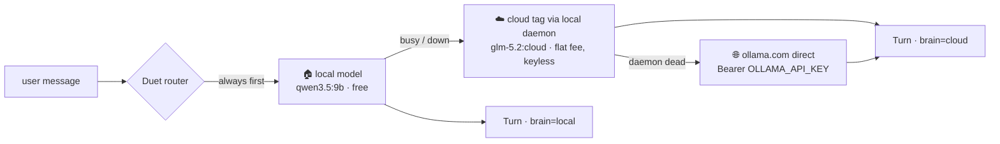

# Duet — near-frontier AI for your apps, $20/month flat

**The exit ramp from frontier-API pricing.** 80–90% of what an application
assistant or automation fleet does — status queries, doc lookups, tool
calls, triage, drafting — never needed a frontier model. Duet routes that
majority to an open-weight model on your own hardware at **$0 marginal
cost**, and escalates the genuinely hard asks to **near-frontier
open-weight models** (hundreds of billions of parameters) on Ollama's
cloud — under a flat **$20/month** plan, against $100–200/month for the
Max tiers of the frontier providers, or an unbounded per-token bill.

One assistant, two brains, one API shape. Anything you mark private is
structurally unable to leave your infrastructure.

## Why this exists

Frontier-model pricing keeps climbing, and per-token billing has no
ceiling — your assistant's bill grows with every question your team asks
it. Meanwhile open-weight models crossed the "good enough for the everyday
80%" line a while ago, and the near-frontier tier (GLM, Kimi, DeepSeek,
Qwen at hundreds of billions of parameters) now rents at a flat
subscription with **no overage billing path**.

There's a security story here too, and it's underappreciated: the
strongest open weights largely come from Chinese labs, and using them via
the vendors' own hosted APIs raises data-residency questions many teams
can't accept — while self-hosting a 700B model is a five-figure hardware
problem. **Ollama hosts these open weights on its own infrastructure in
the US, Europe, and Singapore, under a no-logging, no-training policy** —
the model quality without sending data to the model vendor. Duet then adds
the hard layer on top: tools you mark private are unreachable from cloud
turns entirely.

What was missing was the pattern that composes all of this honestly:
local by default, near-frontier on demand, price capped by contract
instead of budgeting code, privacy enforced in dispatch instead of
promises.

The end state this enables: **application-specific assistants** — fed your
own docs and private source data, embedded in the app's web window — that
can walk an operator through any question, watch the automation fleet,
stage actions (file the feature request, prep the restart) for one-click
human approval, and move fluidly between the local brain and staged cloud
models as the work demands. All inside twenty dollars.

`ollama-duet` is a small (~200-line, stdlib-only) toolkit that does exactly
that:

- **Tier 1 — local, free.** A small open-weight model (e.g. `qwen3.5:9b`)
  on your own [Ollama](https://ollama.com) answers the everyday questions.
  Cost: electricity. Privacy: total.
- **Tier 2 — cloud, flat-fee.** When the local model is busy or erroring, the
  SAME call retargets to a huge open-weight model (e.g. `glm-5.2`, hundreds
  of billions of parameters) running on Ollama's GPUs — through your
  signed-in local daemon, **no API key, no code changes, no new SDK**.
  Ollama's Pro plan is throttle-capped, not metered: **there is no overage
  billing path.** ~$20/month is a hard ceiling enforced by the plan itself.
- **Tier 3 — direct, for total outages.** If the local daemon itself is down,
  the router goes straight to `https://ollama.com/api/chat` with an API key.
  Same request shape. Optional — without a key it degrades to a clear message.

Because all three tiers speak Ollama's **native `/api/chat`**, failover is a
retarget, not a rewrite: same messages, same tool schema, same loop.



## The math, honestly

| | Frontier API (per-token) | Frontier "Max" plan | Duet |
|---|---|---|---|
| Everyday turn (80–90%) | metered, forever | subscription | **$0** (your GPU) |
| Hard turn | metered, same model | subscription | near-frontier open-weight, **flat fee** |
| Monthly worst case | **unbounded** | $100–200 | **~$20, enforced by the plan** |
| Private data | in every prompt | in every prompt | **local turns never leave; withheld from cloud turns by dispatch** |
| Provider outage | dead | dead | local tier keeps answering |

## Quickstart (5 minutes)

**The one requirement:** a machine that can run a small (<12B) open-weight
model locally — a modern GPU with 8–12 GB of VRAM or an Apple Silicon Mac.
The local tier carries the everyday majority; the cloud brain activates
only when real inference horsepower is required. Without a viable local
machine the $20 cap still holds, but you'll feel the throttle.

1. [Install Ollama](https://ollama.com/download) and pull a local brain:
   ```
   ollama pull qwen3.5:9b
   ```
2. (Optional but the whole point) subscribe to
   [Ollama Pro](https://ollama.com/pricing), sign in
   (`ollama signin`), and register a big cloud brain — it's just a manifest,
   inference runs on their GPUs:
   ```
   ollama pull glm-5.2:cloud
   ```
3. Copy the `duet/` folder into your project (it's two files, stdlib only —
   no pip install), register your tools, chat:

   ```python
   from duet import Duet, Toolbox

   box = Toolbox()

   @box.tool("Live order count and deploy status.")
   def get_status():
       return f"{orders.open_count()} open orders; deploy green"

   @box.tool("Look up a customer (name, plan, contact).",
             {"type": "object",
              "properties": {"key": {"type": "string"}},
              "required": ["key"]},
             cloud_safe=False)        # <- PII never reaches the cloud brain
   def lookup_customer(key: str):
       return db.customers.get(key)

   duet = Duet(toolbox=box, system="You are MyApp's assistant. Be brief.")

   turn = duet.chat(history, "how are we doing today?",
                    context=get_status())     # ground every turn in live state
   print(turn.brain, turn.text)               # "local", almost always
   ```

## The flagship demo: Foreman 🛠️

`examples/foreman` is an ops console for a fleet of AI automations, with
the assistant embedded in the web window — the shape this pattern was
built for. Five beats:

```
pip install fastapi uvicorn
uvicorn examples.foreman.app:app --port 8702
# open http://localhost:8702
```

1. **"why did report-gen fail?"** → ⚡ **local, $0** — reads the real run
   log and answers grounded.
2. **"how do I add a retry policy?"** → ⚡ local — answers **from your own
   docs** (`search_docs`), quoted, not from model memory. Feed it your
   real docs folder and you have an application assistant that knows YOUR
   system.
3. **"design a backfill plan for the failed runs that respects rate
   limits"** → ☁ **near-frontier** — the ask is engineering-shaped, so
   `smart_escalate` (a 5-line pluggable policy) sends it straight to the
   big open-weight brain. Still inside the flat $20.
4. **"file a feature request for run-level alerting"** → the assistant
   **stages** the request and hands the operator a button. The queue
   changes when the human clicks — the model cannot write.
5. **"what's our rate on the Meridian contract?"** → the client book is
   `cloud_safe=False`: answered locally, **withheld by the dispatch layer
   on cloud turns**, and the assistant says so honestly. Revenue data
   never rides a third-party turn.

Every reply is badged — **⚡ local · $0** or **☁ near-frontier** — so the
operator always knows what a given answer cost and what it could see.
Swap the fictional dicts for your run store, docs folder, and tracker API
and Foreman is a production shape, not a toy.

Two smaller examples with the same wiring: **Orbit** 🛰️
(`demo/app.py`, a SaaS product dashboard) and **Hearth** 🏡
(`examples/hearth`, a household hub — proof the pattern reaches consumer
apps too).

## The three design rules that make it trustworthy

1. **Grounded.** Every turn injects a live status digest (`context=`) and the
   model answers by CALLING tools that read real state — never from memory of
   how things "usually" are. Small models are fine assistants when you stop
   asking them to remember and start letting them look.
2. **Proposes, never fires.** Anything that writes data or costs money is a
   `propose_action` tool that renders a button the USER clicks. The model
   hands you a loaded form; it does not pull the trigger.
3. **Privacy, enforced twice.** Mark a tool `cloud_safe=False` and the cloud
   brain (a) never sees it in its schema and (b) gets a refusal from dispatch
   even if it hallucinates the call by name. Your customer data cannot leave
   on a cloud turn — that's a property of the code, not a hope about the model.

Surface `turn.brain` in your UI (the demo shows a ☁ badge) so users always
know whether an answer stayed on-machine.

## Choosing and tuning models

- **Local brain:** anything that tool-calls reliably and fits your VRAM —
  `qwen3.5:9b` is a great default on 12 GB. Swap per-deployment with the
  `DUET_LOCAL_MODEL` env var; A/B a new brain in minutes, no code change.
- **Cloud brain:** the flagship open-weight models rotate — `glm-5.2:cloud`,
  `kimi-k3:cloud`, `deepseek-v4-flash:cloud` (1M context). Swap with
  `DUET_CLOUD_MODEL`.
- **Trainable:** because both brains are open-weight and local-first, you can
  fine-tune or adapt your local model (Modelfiles, LoRA adapters, system-prompt
  distillation of your app's vocabulary) and keep the cloud tier as the
  untouched heavyweight. Your assistant learns YOUR app; the big brain covers
  the long tail.
- **Thinking-mode gotcha:** reasoning models like qwen3.5 default to a
  thinking pass that can eat the whole response budget on a snappy assistant
  turn. Pass `Duet(..., think=False)` to turn it off where supported.
- **Cold starts:** the first local turn after idle loads the model into VRAM
  (tens of seconds). Duet treats a timeout as "busy" and fails over to the
  cloud tier — your user still gets an answer, badged honestly. Tune
  `keep_alive` to your traffic.

## Testing

No network or Ollama needed — the transport is injected:

```
python tests/test_duet.py     # stdlib runner
pytest tests/                 # same asserts
```

Covers: the tool loop, schema withholding, dispatch withholding (the
hallucinated-call case), failover banner, daemon-dead → direct tier with the
bare model name, and the everything-down/no-key clear-message path.

## Where it fits

The pattern is deliberately app-agnostic — anywhere a person or a pipeline
would benefit from asking questions in plain language against live state:

- **Automation brains** — workflow engines (n8n, Airflow, home-grown) call
  `duet.chat()` for classification, drafting, and triage steps: bulk work
  rides the free local tier, hard judgment calls ride the flat-fee
  near-frontier brain, and the bill never grows with volume. This is the
  "move 90% of your automation spend off frontier APIs" play.
- **Application-specific assistants** — feed the toolbox your docs and
  private source data and embed the assistant in the app's web window
  (Foreman's shape): it walks operators through any operational question,
  stages actions for one-click approval, and swaps brains as the work
  demands.
- **An internal ops/admin copilot** — wrap your dashboards' data in tools
  and ask "what's stuck?" instead of clicking through five screens.
- **A SaaS product assistant** — grounded answers about the customer's own
  account, buttons into the right page, PII fenced local (Orbit's shape).
- **A developer assistant over your own tooling** — build status, deploy
  state, log summaries as tools; the assistant navigates, you decide.

In every case the same three properties hold: the everyday turns are free,
the hard turns are flat-fee, and anything you mark private stays home.

## License

MIT — see [LICENSE](LICENSE).
