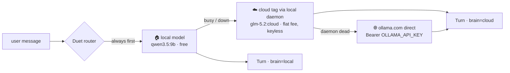

# Duet — a $20 genius for every app you run

**One assistant, two brains, one API shape. The everyday questions are
answered free on your own machine; the hard ones escalate to a
frontier-class open-weight model for a flat ~$20/month — and anything you
mark private is structurally unable to leave home.**

No meter. No per-token anxiety. No "sorry, that data went to a third
party." An assistant that gets *smarter when it needs to* and stays
*yours* the whole time.

You want an in-app assistant — a chatbot that actually knows your app's live
state, can look things up, and hands you buttons instead of hallucinating
actions. You don't want a metered API bill that grows with every question,
and you don't want your private data leaving the building.

`ollama-duet` is a small (~200-line, stdlib-only) toolkit that does exactly
that:

- **Tier 1 — local, free.** A small open-weight model (e.g. `qwen3.5:9b`)
  on your own [Ollama](https://ollama.com) answers the everyday questions.
  Cost: electricity. Privacy: total.
- **Tier 2 — cloud, flat-fee.** When the local model is busy or erroring, the
  SAME call retargets to a huge open-weight model (e.g. `glm-5.2`, hundreds
  of billions of parameters) running on Ollama's GPUs — through your
  signed-in local daemon, **no API key, no code changes, no new SDK**.
  Ollama's Pro plan is throttle-capped, not metered: **there is no overage
  billing path.** ~$20/month is a hard ceiling enforced by the plan itself.
- **Tier 3 — direct, for total outages.** If the local daemon itself is down,
  the router goes straight to `https://ollama.com/api/chat` with an API key.
  Same request shape. Optional — without a key it degrades to a clear message.

Because all three tiers speak Ollama's **native `/api/chat`**, failover is a
retarget, not a rewrite: same messages, same tool schema, same loop.



## Why this beats a metered API for an app assistant

| | Metered API (typical) | ollama-duet |
|---|---|---|
| Everyday question | $0.01–0.10 per turn, forever | **$0** (your GPU) |
| Hard question | same model, same price | a 100×-larger open-weight model, **flat fee** |
| Monthly worst case | unbounded | **~$20, enforced by the plan** |
| Private data | in every prompt you send | **never leaves on local turns; withheld from cloud turns** |
| Offline / provider outage | dead | local tier keeps answering |

## Quickstart (5 minutes)

1. [Install Ollama](https://ollama.com/download) and pull a local brain:
   ```
   ollama pull qwen3.5:9b
   ```
2. (Optional but the whole point) subscribe to
   [Ollama Pro](https://ollama.com/pricing), sign in
   (`ollama signin`), and register a big cloud brain — it's just a manifest,
   inference runs on their GPUs:
   ```
   ollama pull glm-5.2:cloud
   ```
3. Copy the `duet/` folder into your project (it's two files, stdlib only —
   no pip install), register your tools, chat:

   ```python
   from duet import Duet, Toolbox

   box = Toolbox()

   @box.tool("Live order count and deploy status.")
   def get_status():
       return f"{orders.open_count()} open orders; deploy green"

   @box.tool("Look up a customer (name, plan, contact).",
             {"type": "object",
              "properties": {"key": {"type": "string"}},
              "required": ["key"]},
             cloud_safe=False)        # <- PII never reaches the cloud brain
   def lookup_customer(key: str):
       return db.customers.get(key)

   duet = Duet(toolbox=box, system="You are MyApp's assistant. Be brief.")

   turn = duet.chat(history, "how are we doing today?",
                    context=get_status())     # ground every turn in live state
   print(turn.brain, turn.text)               # "local", almost always
   ```

## The flagship demo: Hearth 🏡

Everyone has a household. `examples/hearth` is a family hub whose assistant
shows all three properties in ninety seconds:

```
pip install fastapi uvicorn
uvicorn examples.hearth.app:app --port 8701
# open http://localhost:8701
```

1. **"whose turn is dishes?"** → answered 🏠 **at home**, free, instant.
2. **"plan next week's dinners around the pantry, the practice schedule,
   and the budget"** → the ask is planning-shaped, so it **auto-escalates**
   to the ☁ big brain (see `smart_escalate` — a 5-line policy you can
   replace with anything: message length, a classifier, a checkbox).
3. **"what is Riley allergic to?"** → works at home; on a cloud turn the
   allergy and budget tools are **withheld by the dispatch layer**, and the
   assistant says so honestly. The family's health and money data never
   leave the house — by code, not by promise.
4. **"add tortillas to the shopping list"** → the assistant **proposes a
   button**; the list changes only when *you* click it. The model cannot
   write — the write lives behind the click.

The third beat is the one to watch: same assistant, same question, and the
answer's *reach* depends on which brain is running — enforced, visible,
badged. Together the four beats are the whole integration: free everyday
turns, automatic escalation, a hard privacy fence, and human-held triggers.

## The SaaS-shaped demo: Orbit 🛰️

A tiny fictional product dashboard with the same wiring
(`uvicorn demo.app:app --port 8700`): live status tools, a
`cloud_safe=False` customer lookup, and propose-a-button-never-act.

## The three design rules that make it trustworthy

1. **Grounded.** Every turn injects a live status digest (`context=`) and the
   model answers by CALLING tools that read real state — never from memory of
   how things "usually" are. Small models are fine assistants when you stop
   asking them to remember and start letting them look.
2. **Proposes, never fires.** Anything that writes data or costs money is a
   `propose_action` tool that renders a button the USER clicks. The model
   hands you a loaded form; it does not pull the trigger.
3. **Privacy, enforced twice.** Mark a tool `cloud_safe=False` and the cloud
   brain (a) never sees it in its schema and (b) gets a refusal from dispatch
   even if it hallucinates the call by name. Your customer data cannot leave
   on a cloud turn — that's a property of the code, not a hope about the model.

Surface `turn.brain` in your UI (the demo shows a ☁ badge) so users always
know whether an answer stayed on-machine.

## Choosing and tuning models

- **Local brain:** anything that tool-calls reliably and fits your VRAM —
  `qwen3.5:9b` is a great default on 12 GB. Swap per-deployment with the
  `DUET_LOCAL_MODEL` env var; A/B a new brain in minutes, no code change.
- **Cloud brain:** the flagship open-weight models rotate — `glm-5.2:cloud`,
  `kimi-k3:cloud`, `deepseek-v4-flash:cloud` (1M context). Swap with
  `DUET_CLOUD_MODEL`.
- **Trainable:** because both brains are open-weight and local-first, you can
  fine-tune or adapt your local model (Modelfiles, LoRA adapters, system-prompt
  distillation of your app's vocabulary) and keep the cloud tier as the
  untouched heavyweight. Your assistant learns YOUR app; the big brain covers
  the long tail.
- **Thinking-mode gotcha:** reasoning models like qwen3.5 default to a
  thinking pass that can eat the whole response budget on a snappy assistant
  turn. Pass `Duet(..., think=False)` to turn it off where supported.
- **Cold starts:** the first local turn after idle loads the model into VRAM
  (tens of seconds). Duet treats a timeout as "busy" and fails over to the
  cloud tier — your user still gets an answer, badged honestly. Tune
  `keep_alive` to your traffic.

## Testing

No network or Ollama needed — the transport is injected:

```
python tests/test_duet.py     # stdlib runner
pytest tests/                 # same asserts
```

Covers: the tool loop, schema withholding, dispatch withholding (the
hallucinated-call case), failover banner, daemon-dead → direct tier with the
bare model name, and the everything-down/no-key clear-message path.

## Where it fits

The pattern is deliberately app-agnostic — anywhere a person or a pipeline
would benefit from asking questions in plain language against live state:

- **A SaaS product assistant** — the demo's shape: grounded answers about
  the user's own account, buttons into the right page, PII fenced local.
- **An internal ops/admin copilot** — wrap your dashboards' data in tools
  and ask "what's stuck?" instead of clicking through five screens. This is
  the fastest way to give yourself a personal assistant for getting around
  the web apps you already run.
- **A developer assistant over your own tooling** — build status, deploy
  state, log summaries as tools; the assistant navigates, you decide.
- **Automation brains** — cron jobs and workflow engines (n8n, Airflow,
  home-grown) can call `duet.chat()` for classification, drafting, and
  triage steps: bulk work rides the free local tier, hard judgment calls
  ride the flat-fee big brain, and the bill never grows with volume.
- **Personal and home apps** — a household dashboard, a hobby project, a
  private tracker: assistants for apps that could never justify a metered
  API bill.

In every case the same three properties hold: the everyday turns are free,
the hard turns are flat-fee, and anything you mark private stays home.

## License

MIT — see [LICENSE](LICENSE).
